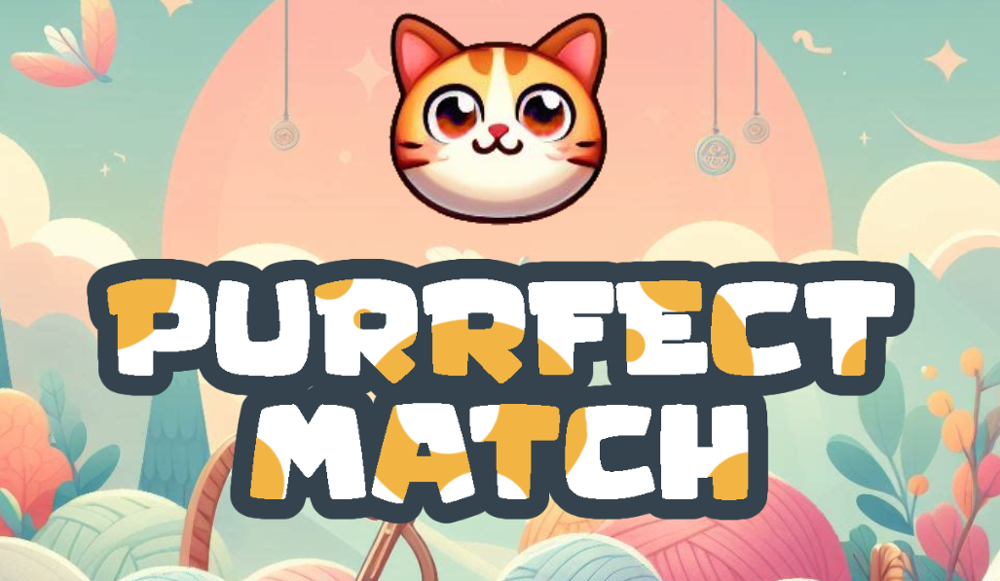

# Purrfect Match Game 🐈🐾

## Description

Welcome to the exciting world of our match-3 puzzle game! In this colorful and addictive game, your goal is to strategically match three or more identical cats to earn points!🎯




## Installation Instructions

_You can play it online here [Purrfect Match](https://purrfectmatch.surge.sh/index.html)_

1. Clone the repository

``` 
git clone https://github.com/Fatema-J/Purrfect-Match-Game.git 
```


2. Navagate to the project directory
```
cd Purrfect-Match-Game
```

3. Open the index.html file in your browser, and enjoy the game!


## Game Logic

1. The game generates an nxn grid of four different elements on the screen. Each cell in the grid can contain one of these elements.


2. When the player choose an element, we need to:
    - Identify possible drag targets (i.e., adjacent cells where the element can be moved).
    - Check if the chosen element will make a match with adjacent elements.
    - If the chosen element will make a match (e.g., three or more identical elements in a row/column), allow the move.
  
     
3. If a match is allowed:
    - Delete the matched elements from the grid.
    - Drop new elements from above to replace the matched ones.
    - This can be done by shifting down the elements in the columns above the matched cells and generating new elements at the top.
    - The new elements can be randomly chosen from the available pool of elements.
    - check if the new elements match.

4. The player will earn points for matched elements. 

5. Once the timer is up the game will be over and highest score will be recorded.


## Features
- animations
- restart game option
- pause game option
- timer
- score


## Additional Features


- [ ] Dark Mode
- [x] Make customized branding for the game (logo, colors, fonts)
- [ ] Add sounds for every move
- [x] Pause button
- [ ] Drag instead of choosing
- [x] Timer
- [ ] Animations for the matched elements


## Credits

The concept for **Purrfect Match Game** was inspired by Candy Crush Saga.


